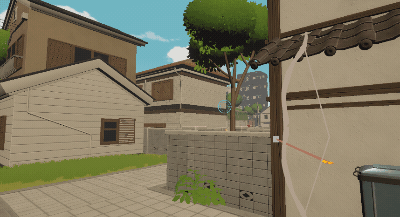

A overlay and outline effect for Unity(like LunaKim's detection skill in Delta Force), show hidden characters behind walls using custom stencil.(Unity6 URP)

一个用于 Unity 的遮罩与描边效果（类似《三角洲行动》中露娜的探测技能），通过自定义模板缓冲区显示被墙体遮挡的角色。

GIF:

